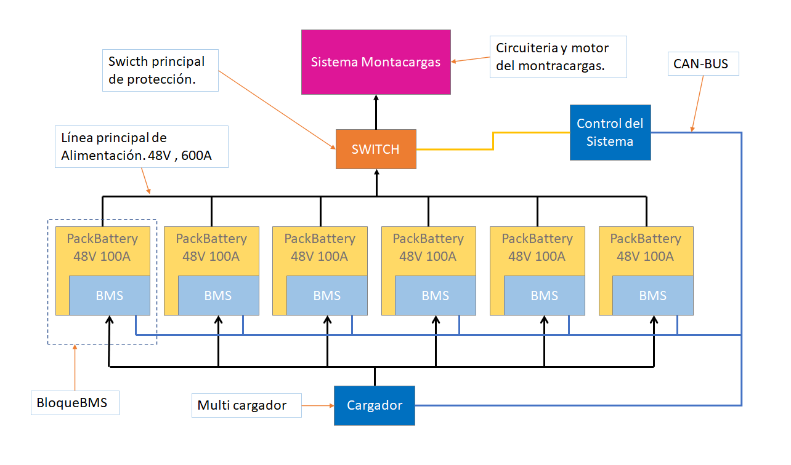

# Batería para montacargas eléctrico.
### Información general.
*Montacargas Eléctricos: Una versión de maquinaria indispensable para la industrias donde el desplazamiento de cargas grandes es parte de su proceso.*

*El uso de un montacargas eléctrico tiene inconvenientes que deben ser considerados antes de su incorporación.*

*uno de estos inconvenientes es la destinación de un área especifica para su recarga, la cual depende directamente de la frecuencia de uso en un espacio determinado.*

*El otro inconveniente mas resaltante de este tipos de vehículos, son sus baterías, ya que su recarga suele demorar horas, las cuales tendrán que ser agendadas para minimizar el paro de la producción. Una solución simple es recurrir al uso de dos o mas baterías de respaldo para evitar estos paros y que en algunos casos son criticos.*

*Y por ultimo esta, el deterioro de las baterías. No es relevante este aspecto en el análisis de este documento ya que el deterioro es una parte intrínseca de cualquier sistema a base de baterias.*

### Actualidad.
*Hoy en día esta tecnología se vuelve cada vez mas accesible y eficiente, gracias a la mejora de las baterías y los sistemas de recarga rápida. sin embargo el uso de baterías de plomo genera un problema que a simple vista parecería una ventaja, el peso. El peso de las baterías de plomo ayudan a generar contrapeso útil para el montacargas, sin embargo, la cargar eléctrica con respecto del espacio ocupado suele ser poca comparándola con la capacidad de carga y descarga de otras tecnologías como las de iones de litio, sin mencionar la eficiencia.*

*Para una comparación mas detalla entre las baterías de plomo y las baterías de litio puede revisar este enlace de [toyota](https://blog.toyota-forklifts.es/baterias-litio-o-baterias-plomo-acido), donde se presenta un análisis mas detallado.*

*Actualmente la industria esta integrando baterías para montacargas echas con baterías de litio. Las baterías de litio requieren de un sistema electrónico especial, debido a la sensibilidad del voltaje de carga y descarga, ya que operan en un rango muy especifico y sobrepasar estos limites podría dañar la batería o incluso incendiarse.*

### BMS
*El BMS o sistema de gestión de baterías por sus siglas en ingles (Battery Management System), es un sistema electrónico diseñado específicamente para la recarga de baterías de iones de litio o tecnologías similares como las baterías life. Estos sistemas se encargan de monitoreas y controlar el voltaje suministrado a cada una de las baterías que integra un paquete de baterias.* 

*Muchos BMS tienen la capacidad de cortar el suministro de corriente o la carga, si las condiciones de la batería se ve afectada por diversos factores como: la temperatura, la sobre corriente, el sobre voltaje y el corto circuito;  alargando la vida útil de las baterías. Para mas información revisar "[bms](https://www.evexpert.es/eshop1/centro-de-conocimiento/sistema-de-gestion-de-baterias)".*

## Desarrollo de una batería para montacargas.
### Propuesta.
*El mercado actual esta demostrando un alto interés en el remplazo de los vehículos de combustión interna por los de baterías, abriendo las puertas para nuevas empresas que puedan solventar la demanda de las tecnologías necesarias para que este cambio ocurra. Tecnologías como: baterías , BMS, motores eléctricos de alto torque y controladores de motores; Ya que son estos los componentes básicos para construir un vehículo eléctrico.*

*En este documento se propone el desarrollo de un sistema de gestión de baterías(BMS) para montacargas y de una aplicación móvil para el monitoreo y configuración de este, así como el software necesario para el desarrollo.*

### Requisitos.

***Características del BMS:***

 - *Gestionar las cargas y descargas de las baterías.*
 - *Proteger la batería contra temperatura, sobre corriente, sobre voltaje, sobre descarga y corto circuito.*
 - *Proporcionar información de cada una de las celdas de batería y las zonas de temperaturas.*
 - *Activación y desactivación del switch de protección a voluntad.*
 - *Incluir protocolos de comunicación como: BlueTooth, RS-485  y CAN-BUS para el control y configuración del BMS.*
 - *Conexion con la APP.*

***Características de la aplicación móvil.***

 - *Conexión BlueTooth con el BMS.*
 - *Configuración del tipo de batería que el BMS tendrá que controlar.*
 - *Configuración de los voltajes máximos y mínimos de las celdas.*
 - *Configuración de las reglas de seguridad como: máxima corriente permitida, tiempo de funcionamiento continuo, corriente de carga, temperatura máxima, etc.*
 - *Id de usuario.*
 - *Notificaciones y alertas de eventos críticos de la batería por ejemplo: notificación de carga terminada, notificación de descarga mínima, errores, fallas, etc.*

***Dificultades.***

*Los BMSs suelen estar diseñados para corrientes máximas especificas debido al método de fabricación ya que se utiliza la misma PCB para la montura de los componentes de alta potencia, que no son mas que los elementos que controlan la corriente de carga de la batería y el switch para el corte de la corriente en caso de que ocurra alguna de las alarmas descritas anteriormente.*

*El problema se hace evidente cuando las características del montacargas, nos dice que requiere de una alta corriente para que el motor eléctrico funcione adecuadamente, sin contar por otra parte con la autonomía de la batería lo cual genera un problema mas.*

***Solución.***

*Se propone la implementación de un sistema modular compuesto de varios BMS trabajando en conjunto para proporcionar la potencia necesaria para el funcionamiento adecuando del montacargas.*

*Este tipo de sistemas no son nuevos, de echo son utilizados en la industria de los vehículos eléctricos, como el vehículo de Tesla.*

*En la imagen de arriba se puede apreciar como los bloques de baterías con sus BMS integrados cada uno, esta conectados a la linea principal de alimentación del vehículo resolviendo el problema de la alta corriente y la autonomía. Permitiendo la expansión de estos parámetros agregando módulos, sin ningún problema mas que del espacio que se dispone.*

*Aquí se presenta el diagrama de bloques propuesto para el BMS de la batería del montacargas.*

### Tiempo de desarrollo

*El tiempo estimado depende de la complejidad y alcance deseada del proyecto.*

*Para el BMS el desarrollo puede variar entre uno a dos meses. y para la aplicación móvil seria un tiempo similar uno a dos meses.*

*Dando un tiempo estimado al proyecto de 4 meses máximo para un producto mínimo viable (MVP)*

*Nota: durante el desarrollo se evaluara semanalmente la viabilidad del proyecto permitiendo tomar decisiones que permitan la conclusión del proyecto en términos razonables para las partes involucradas.*

*Toda la propiedad intelectual como: documentación, diagramas, algoritmos y tecnologías desarrolladas serán propiedad de la parte financiadora, con la condición del uso de dicha propiedad intelectual, por el desarrollador. No replicando tal cual el proyecto para su beneficio personal.*
